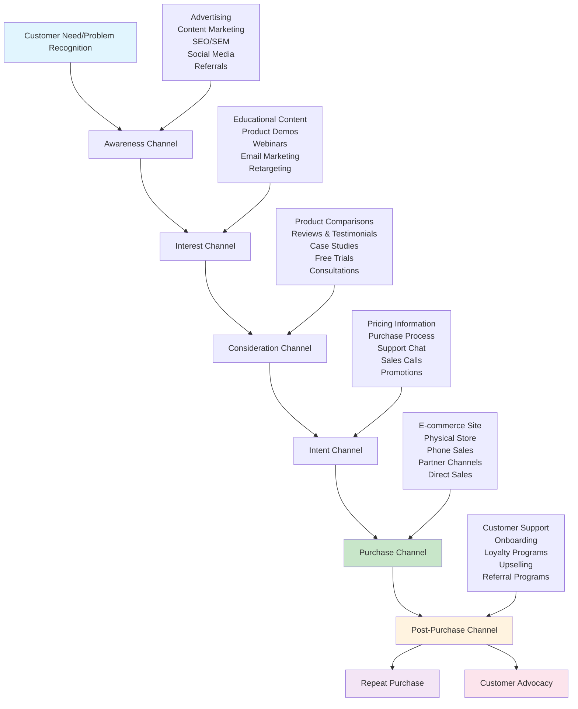

Here's a Mermaid diagram showing the customer journey channels leading to purchase:

This diagram shows:
- **Linear progression** through the customer journey
- **Supporting channels** for each stage
- **Feedback loops** from post-purchase to repeat business
- **Different channel types** at each touchpoint leading ultimately to purchase
